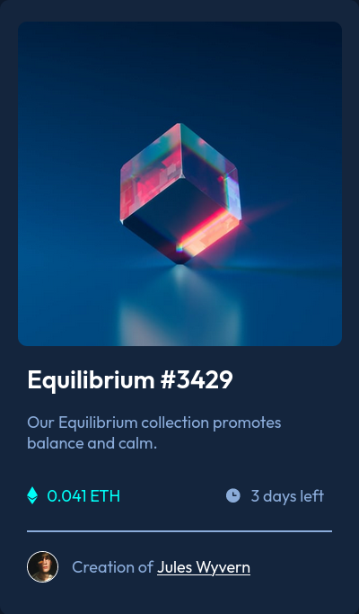

# Frontend Mentor - NFT preview card component solution

This is a solution to the [NFT preview card component challenge on Frontend Mentor](https://www.frontendmentor.io/challenges/nft-preview-card-component-SbdUL_w0U). Frontend Mentor challenges help you improve your coding skills by building realistic projects.

## Table of contents

- [Overview](#overview)
  - [Screenshot](#screenshot)
  - [Links](#links)
- [My process](#my-process)
  - [Built with](#built-with)
  - [What I learned](#what-i-learned)
  - [Continued development](#continued-development)
  - [Useful resources](#useful-resources)
- [Author](#author)
- [Acknowledgments](#acknowledgments)


## Overview

### Screenshot




### Links

- Solution URL: [Source Code](https://github.com/AlexdelCarmen/nft-preview)
- Live Site URL: [Live Page](https://alexdelcarmen.github.io/nft-preview/)

## My process

Started off by creating the HTMl structure and apply styles for mobile first, then I applied the effects, this is where I got stuck on image overlays, but managed to fix it.  

### Built with

- Semantic HTML5 markup
- CSS custom properties
- Flexbox
- Mobile-first workflow

### What I learned

image overlays, never done these before on my own and it was a pain at some point, but with some guidance I was able to finish.  

To see how you can add code snippets, see below:

```html
      <div class="nft-image-container">
        
        
        <div class="nft-img-filter"></div>
      </div>
```
```css
.nft-image-container {
  width: 95%;
  display: flex;
  justify-content: center;
  align-items: center;
  position: relative;
  margin: 0 auto;
}

.nft-eye-icon {
  position: absolute;
  display: none;
  z-index: 10;
  transition: all 0.5s ease;
}

.nft-img {
  width: 100%;
  border-radius: 10px;
}

.nft-img-filter {
  position: absolute;
  top: 0;
  bottom: 0;
  left: 0;
  right: 0;
  height: 100%;
  width: 100%;
  opacity: 0;
  transition: all 0.5s;
  background-color: var(--accent-color-2);
  border-radius: 10px;
  display: flex;
  justify-content: center;
  align-items: center;
}

.nft-image-container:hover {
  cursor: pointer;
}

.nft-image-container:hover .nft-eye-icon {
  display: block;
}

.nft-image-container:hover .nft-img-filter {
  opacity: 0.2;
}

```


### Continued development

Getting better at determining sizes and colors by simple inspection, but still need to work on this. 
Need more practice doing image overlays.

### Useful resources

- [W3Schools](https://www.w3schools.com/) - I used W3Schools to guide me on how to do the image overlay effect on hover/active.

## Author

- Website - [Github Profile](https://github.com/AlexdelCarmen)
- Frontend Mentor - [@AlexdelCarmen](https://www.frontendmentor.io/profile/AlexdelCarmen)
- Twitter - [@AlekBorchov](https://twitter.com/AlekBorchov)

## Acknowledgments

Thanks to everyone hyping me up on this and to FrontEndMentor, I love the challenges! 
